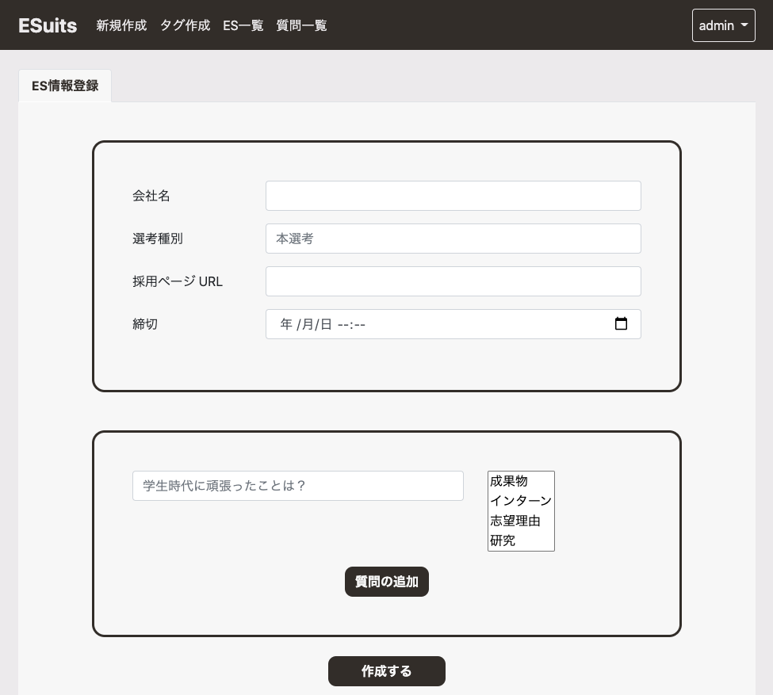

# [ESUITS](https://github.com/jphacks/D_2014)のデータベースを設計し直してアプリケーションを修正
以前ハッカソンで作成したエントリシート作成支援アプリケーションを作成したが，時間もなくデータベースの設計が割と適当だったのであらためて設計し直して適用．

ESUITSデプロイ先 →
https://esuits.herokuapp.com/

 # モデルの再設計
 

ポイント
- ユーザーとタグを多対多にした．(以前は一対多)
- エントリーシートのテーブルから企業テーブルと企業URLテーブルを分離

# アプリケーションそのものの修正
モデルの設計は完了したが，それに伴いアプリそのものを修正しないといけないのでそれについてやったことを書く．
大きく変更し，困りそうなのが以下の2点
- ユーザーとタグが多対多の場合、タグを作成したときの処理の流れ
- エントリーシートを新規作成するときの流れ(企業テーブルと企業URLテーブルが分離したことによってどうなるのか)
## ユーザーとタグが多対多の場合、タグを作成したときの処理の流れ
### シチュエーション
- ユーザーを追加するときには，そのユーザーはタグをもっていないから特に気にすることはない(できれば新規ユーザーにも幾つかデフォルトのタグを与えたい)
- 各ユーザーは必要に応じて自分でタグを作成する．

### 処理フロー
1. ユーザーがタグを作成
1. タグテーブルにそのタグがすでにあるときはそのレコードを取得，ないときはレコードを新規作成
1. ユーザーとタグの中間テーブルにレコードを新規作成

## 新しくエントリーシートを追加するときはどうしたらいいのか
### シチュエーション
1. ユーザーはエントリーシートを新規作成
1. エントリーシートの内容(抜粋)
    * 企業名
    * 採用ページURL
    * 質問(複数)
1. 企業テーブルにおいて企業名でレコードを検索．ない場合は新規作成
1. 企業URLテーブルにおいて3.で取得した企業ID(PK)と企業URLでレコードを検索．ない場合は新規作成．
1. エントリーシートテーブルにエントリーシートそのものを作成
1. 5.で作成したエントリーシートに紐付けて，質問を質問テーブルに保存

 

 # 不具合
 - 異なる企業で同一のURLを使用すると編集画面に遷移するときにエラー
    * 一つのURLに対して紐づく企業は1社なので，2社目以降はURLがないことになる．
